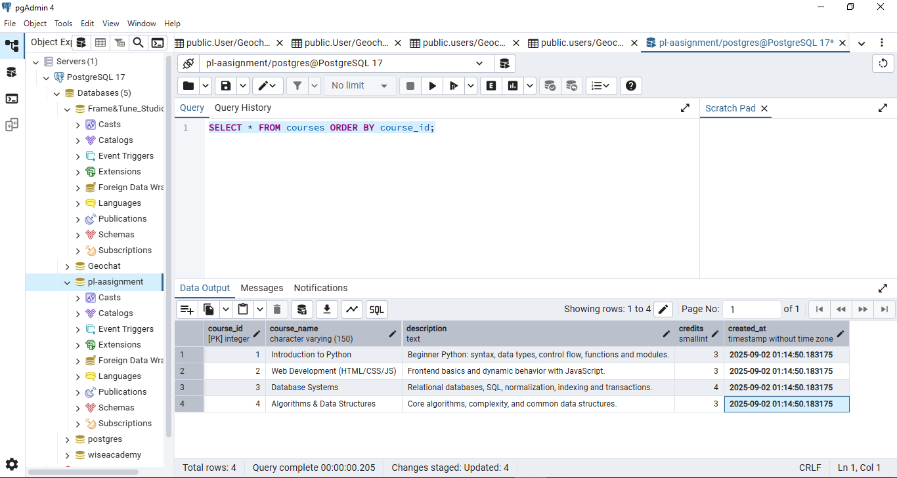
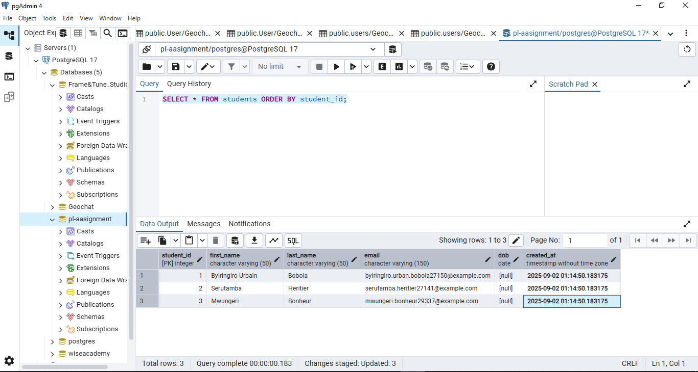
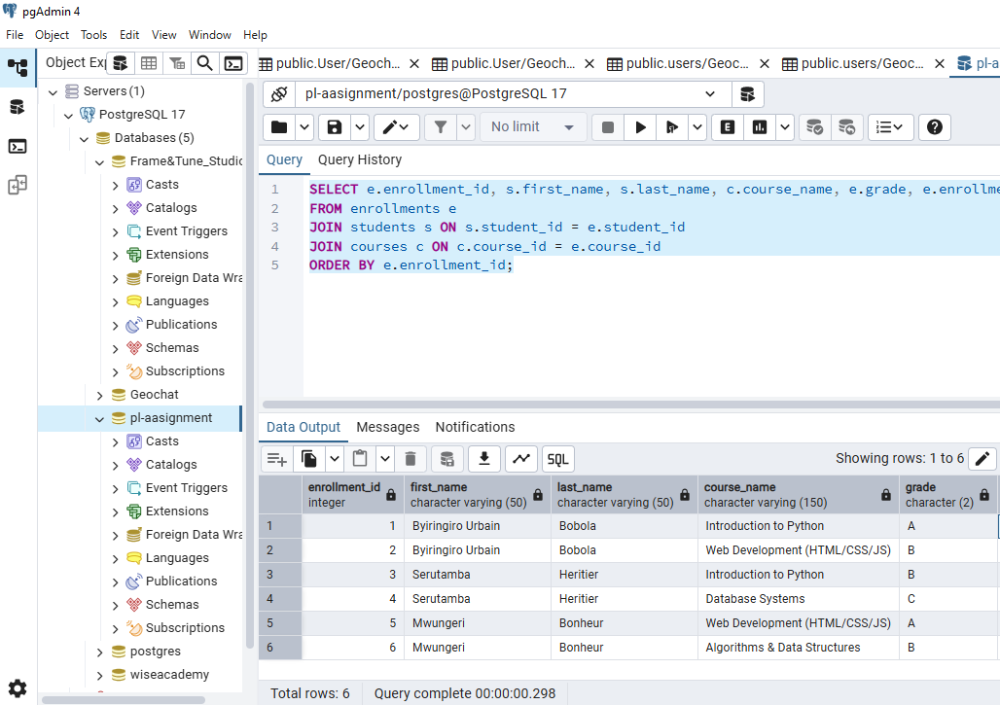
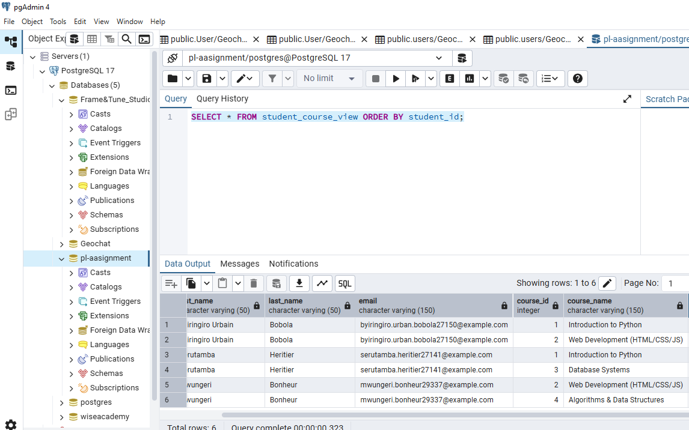

# Names: 
## Byiringiro Urbain Bobola 27150
## Serutamba heritier 27141
## Mwungeri Bonheur 29337


# PL-SQL_Assignment

# Screeenshoot images







# Student-Course Enrollment SQL Project

## 📖 Overview
This project demonstrates fundamental database concepts using SQL:
- Creating normalized tables with constraints (PK, FK, UNIQUE, NOT NULL, CHECK).
- Performing different types of joins (INNER, LEFT, RIGHT, FULL).
- Creating indexes to optimize query performance.
- Creating a view to simplify data access.
- Generating a simple report to explain the design and results.

It is designed as part of a **Class Quiz (Group Work)** assignment.

---

## 🗂 Database Schema
The project uses **three tables**:

1. **students**
   - Stores student details.
   - Constraints: `PRIMARY KEY`, `UNIQUE(email)`, `NOT NULL`.

2. **courses**
   - Stores available courses.
   - Constraints: `PRIMARY KEY`, `CHECK(credits > 0)`.

3. **enrollments**
   - Join table linking students to courses.
   - Constraints: `PRIMARY KEY`, `FOREIGN KEY`, `UNIQUE(student_id, course_id)`, `CHECK(grade)`.

### ER Diagram (Conceptual)


---

## ⚙️ Setup Instructions

### 1. Requirements
- PostgreSQL (preferred) or MySQL.
- VS Code with SQL extension (e.g., SQLTools, PostgreSQL).

### 2. Steps
1. Create a new database:
   ```sql
   CREATE DATABASE dbname;

